# EHub — UML Diagrams

> All diagrams are written in PlantUML.
> Render at: https://www.plantuml.com/plantuml/uml or use a PlantUML-compatible IDE plugin.

---

## Table of Contents

1. [Class Diagrams](#class-diagrams)
   - [Auth Service](#class-diagram-1--auth-service)
   - [Event Domain (Core Entities)](#class-diagram-2--event-domain-core-entities)
   - [Team Domain](#class-diagram-3--team-domain)
   - [AI Service](#class-diagram-4--ai-service)
   - [Notification Service](#class-diagram-5--notification-service)
   - [Cross-Service Communication](#class-diagram-6--cross-service-communication)
2. [Use Case Diagrams](#use-case-diagrams)
   - [Authentication & Account Management](#use-case-diagram-1--authentication--account-management)
   - [Event Management](#use-case-diagram-2--event-management)
   - [Registration & Team Management](#use-case-diagram-3--registration--team-management)
   - [Project Submission & Scoring](#use-case-diagram-4--project-submission--scoring)
   - [AI Evaluation Pipeline](#use-case-diagram-5--ai-evaluation-pipeline)
   - [Notifications](#use-case-diagram-6--notifications)
   - [Complete System Use Case](#use-case-diagram-7--complete-system)
3. [Object Diagrams](#object-diagrams)
   - [User Instances](#object-diagram-1--user-instances)
   - [Event with Problem Statements](#object-diagram-2--event-with-problem-statements)
   - [Team with Members](#object-diagram-3--team-with-members)
   - [Registrations Snapshot](#object-diagram-4--registrations-snapshot)
   - [AI Evaluation Job Snapshot](#object-diagram-5--ai-evaluation-job-snapshot)
   - [Notification & OTP Snapshot](#object-diagram-6--notification--otp-snapshot)
4. [Activity Diagrams](#activity-diagrams)
   - [User Registration & Login](#activity-diagram-1--user-registration--login)
   - [Password Reset](#activity-diagram-2--password-reset)
   - [Event Creation & Phase Lifecycle](#activity-diagram-3--event-creation--phase-lifecycle)
   - [Team Formation & Project Submission](#activity-diagram-4--team-formation--project-submission)
   - [AI Evaluation Pipeline](#activity-diagram-5--ai-evaluation-pipeline)
   - [Teammate Matchmaking](#activity-diagram-6--teammate-matchmaking)
   - [Manual Scoring & Leaderboard](#activity-diagram-7--manual-scoring--leaderboard)
5. [Component Diagrams](#component-diagrams)
   - [Overall System Architecture](#component-diagram-1--overall-system-architecture)
   - [Auth Service Internal](#component-diagram-2--auth-service-internal)
   - [Event Service Internal](#component-diagram-3--event-service-internal)
   - [AI Service Internal](#component-diagram-4--ai-service-internal)
   - [Notification Service Internal](#component-diagram-5--notification-service-internal)
   - [API Gateway & Security](#component-diagram-6--api-gateway--security)
6. [State Machine Diagram](#state-machine-diagram)
7. [Deployment Diagram](#deployment-diagram)

---

## Class Diagrams

### Class Diagram 1 — Auth Service

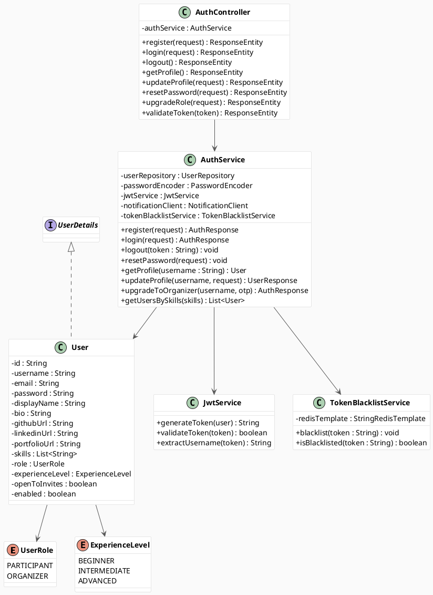

---

### Class Diagram 2 — Event Domain (Core Entities)

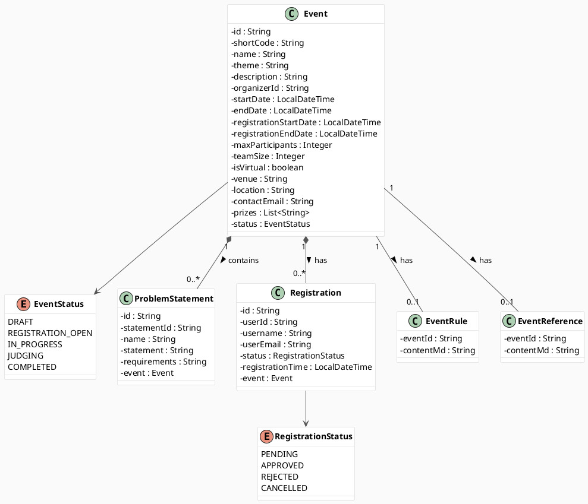

---

### Class Diagram 3 — Team Domain

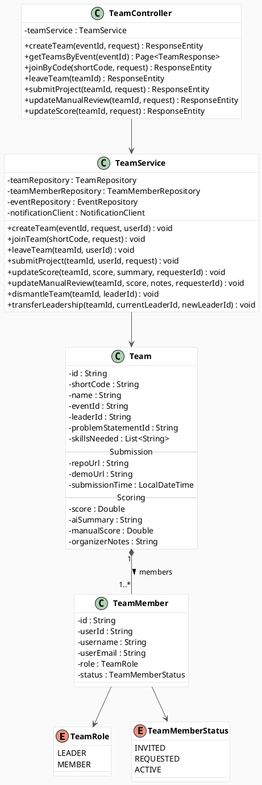

---

### Class Diagram 4 — AI Service

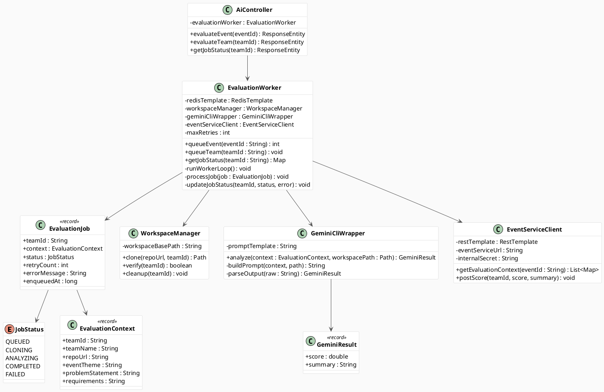

---

### Class Diagram 5 — Notification Service

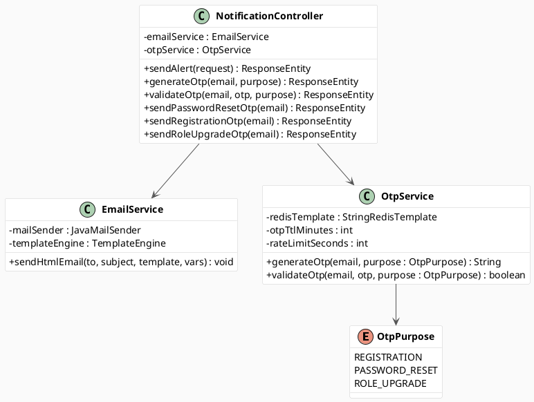

---

### Class Diagram 6 — Cross-Service Communication

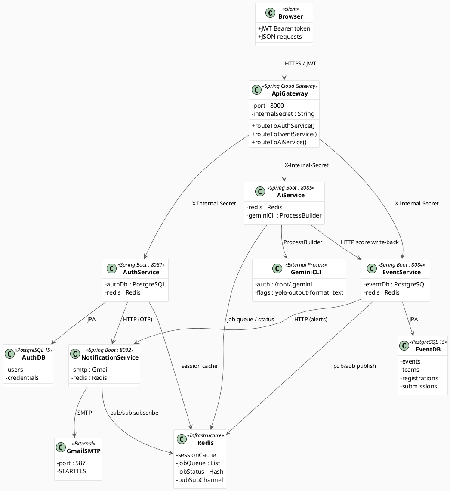

---

## Use Case Diagrams

### Use Case Diagram 1 — Authentication & Account Management

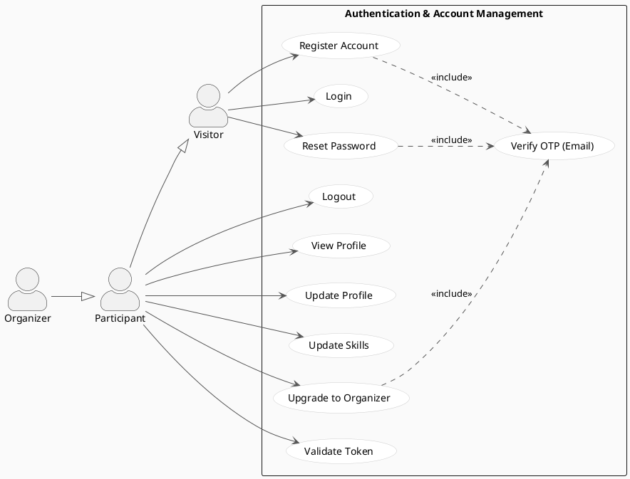

---

### Use Case Diagram 2 — Event Management

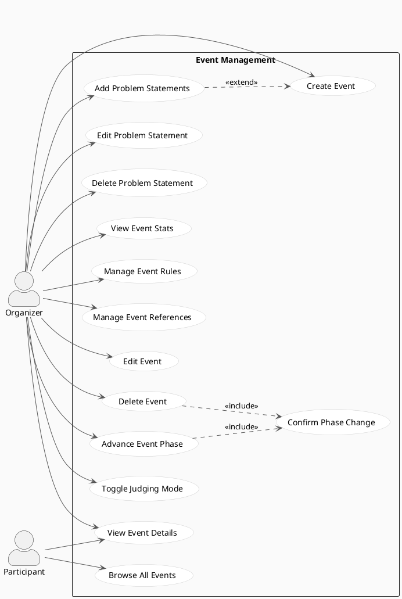

---

### Use Case Diagram 3 — Registration & Team Management

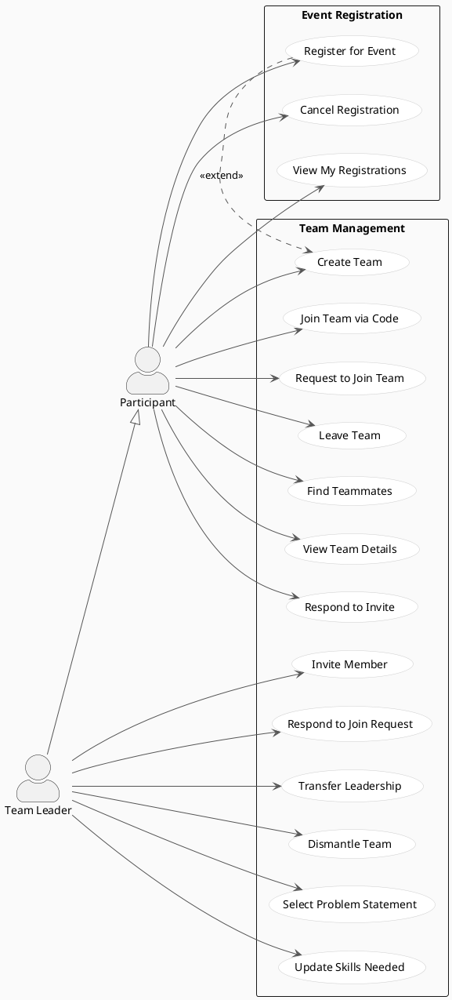

---

### Use Case Diagram 4 — Project Submission & Scoring

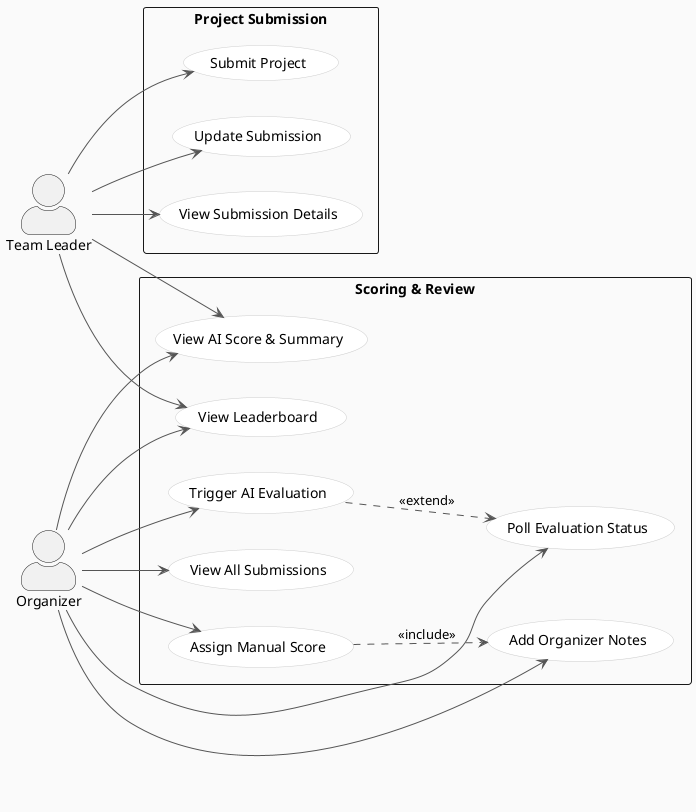

---

### Use Case Diagram 5 — AI Evaluation Pipeline

```plantuml
@startuml UC5_AIEvaluation

left to right direction
skinparam actorStyle awesome
skinparam backgroundColor #FAFAFA
skinparam usecase {
  BorderColor #CCCCCC
  BackgroundColor #FFFFFF
  ArrowColor #555555
}

actor Organizer
actor "AI Worker\n(System)" as AIWorker
actor "Gemini CLI\n(External)" as Gemini
actor "Event Service\n(Internal API)" as EventSvc

rectangle "AI Evaluation Pipeline" {
  usecase "Trigger Evaluation for Event" as UC_Trigger
  usecase "Enqueue Team Jobs (Redis)" as UC_Enqueue
  usecase "Dequeue Job" as UC_Dequeue
  usecase "Clone Repository" as UC_Clone
  usecase "Verify Workspace" as UC_Verify
  usecase "Build Evaluation Prompt" as UC_Prompt
  usecase "Invoke Gemini CLI" as UC_Gemini
  usecase "Parse Gemini Output" as UC_Parse
  usecase "Write Score to Event Service" as UC_WriteScore
  usecase "Update Job Status (Redis)" as UC_Status
  usecase "Cleanup Workspace" as UC_Cleanup
  usecase "Retry on Transient Failure" as UC_Retry
  usecase "Mark Job as FAILED" as UC_Fail
}

Organizer --> UC_Trigger
UC_Trigger ..> UC_Enqueue : <<include>>

AIWorker --> UC_Dequeue
UC_Dequeue ..> UC_Clone : <<include>>
UC_Clone ..> UC_Verify : <<include>>
UC_Verify ..> UC_Prompt : <<include>>
UC_Prompt ..> UC_Gemini : <<include>>
UC_Gemini ..> UC_Parse : <<include>>
UC_Parse ..> UC_WriteScore : <<include>>
UC_WriteScore ..> UC_Cleanup : <<include>>
UC_WriteScore ..> UC_Status : <<include>>

UC_Clone ..> UC_Retry : <<extend>>
UC_Gemini ..> UC_Retry : <<extend>>
UC_Retry ..> UC_Fail : <<extend>>

AIWorker --> UC_Status
Gemini --> UC_Gemini : executes
EventSvc --> UC_WriteScore : receives

@enduml
```

---

### Use Case Diagram 6 — Notifications

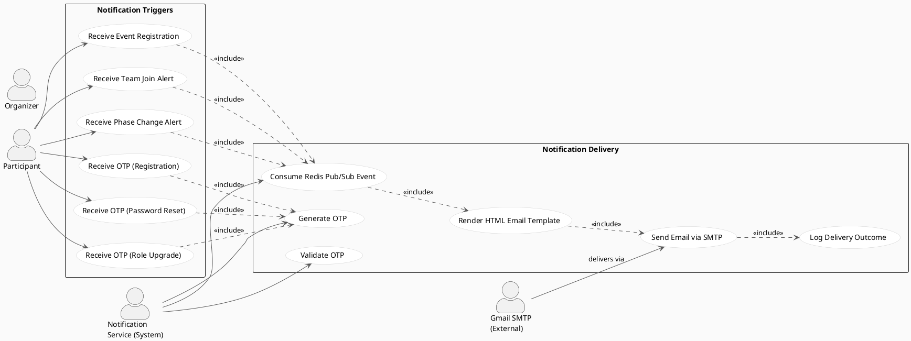

---

### Use Case Diagram 7 — Complete System

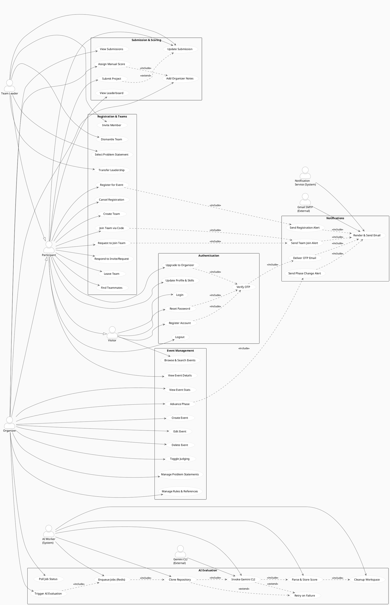

---

## Object Diagrams

### Object Diagram 1 — User Instances

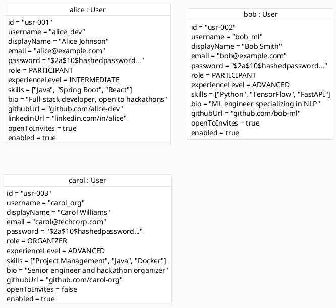

---

### Object Diagram 2 — Event with Problem Statements

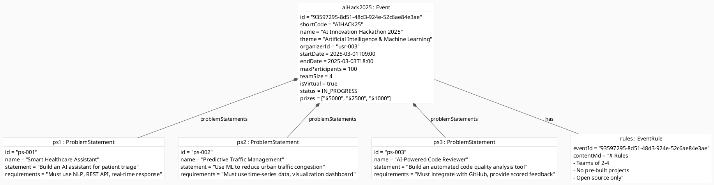

---

### Object Diagram 3 — Team with Members

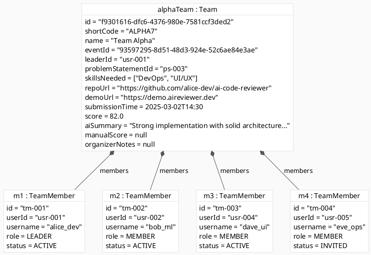

---

### Object Diagram 4 — Registrations Snapshot

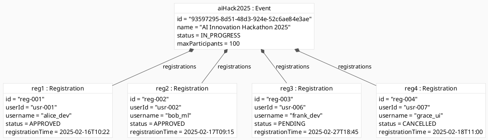

---

### Object Diagram 5 — AI Evaluation Job Snapshot

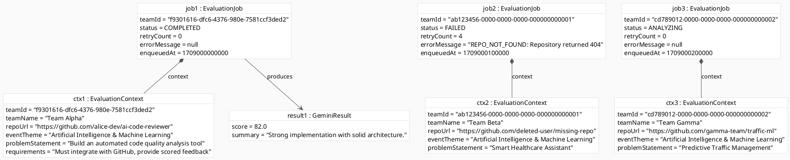

---

### Object Diagram 6 — Notification & OTP Snapshot

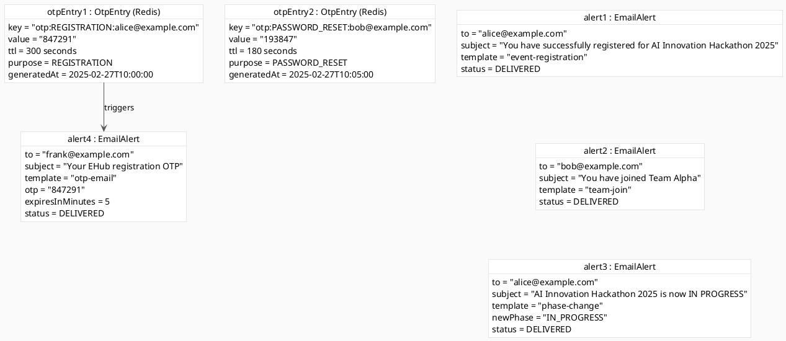

---

## Activity Diagrams

### Activity Diagram 1 — User Registration & Login

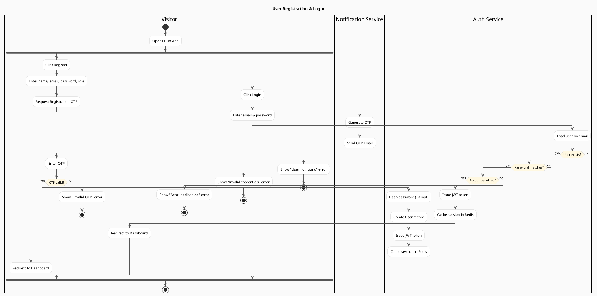

---

### Activity Diagram 2 — Password Reset

```plantuml
@startuml AD2_PasswordReset

skinparam backgroundColor #FAFAFA
skinparam activity {
  BorderColor #CCCCCC
  BackgroundColor #FFFFFF
  ArrowColor #555555
  DiamondBackgroundColor #FFF8E1
  DiamondBorderColor #CCCCCC
}

title Password Reset Flow

|User|
start
:Click "Forgot Password";
:Enter registered email;
|Auth Service|
if (Email exists?) then (yes)
  :Request OTP from Notification Service;
  |Notification Service|
  :Generate time-limited OTP (5 min TTL);
  :Send password reset email;
  |User|
  :Enter OTP from email;
  |Auth Service|
  if (OTP valid & not expired?) then (yes)
    |User|
    :Enter new password;
    |Auth Service|
    :Hash new password (BCrypt);
    :Update user record;
    :Invalidate all active sessions (Redis);
    |User|
    :Show "Password reset successful";
    :Redirect to Login;
  else (no)
    :Show "OTP expired or invalid";
    if (Retry?) then (yes)
      :Re-enter OTP;
    else (no)
      stop
    endif
  endif
else (no)
  :Show "Email not found";
  stop
endif
stop

@enduml
```

---

### Activity Diagram 3 — Event Creation & Phase Lifecycle

```plantuml
@startuml AD3_EventLifecycle

skinparam backgroundColor #FAFAFA
skinparam activity {
  BorderColor #CCCCCC
  BackgroundColor #FFFFFF
  ArrowColor #555555
  DiamondBackgroundColor #FFF8E1
  DiamondBorderColor #CCCCCC
}

title Event Creation & Phase Lifecycle

|Organizer|
start
:Fill in event details\n(name, theme, dates, limits);
:Submit Create Event form;
|Event Service|
:Validate input fields;
if (Valid?) then (yes)
  :Create Event (status = DRAFT);
  |Organizer|
  :Add Problem Statements;
  :Add Rules & References;
  :Confirm — Advance to REGISTRATION_OPEN;
  |Event Service|
  :Update status → REGISTRATION_OPEN;
  |Notification Service|
  :Broadcast phase change email;
  |Organizer|
  :Wait for registrations;
  :Advance to IN_PROGRESS;
  |Event Service|
  :Update status → IN_PROGRESS;
  :Lock registrations;
  |Notification Service|
  :Notify registered participants;
  |Organizer|
  :Monitor submissions;
  :Advance to JUDGING;
  |Event Service|
  :Update status → JUDGING;
  :Lock submissions;
  |Organizer|
  fork
    :Trigger AI Evaluation;
  fork again
    :Assign Manual Scores;
  end fork
  :Advance to COMPLETED;
  |Event Service|
  :Update status → COMPLETED;
  :Finalize leaderboard;
  |Notification Service|
  :Notify participants of results;
  |Organizer|
  :View final leaderboard;
else (no)
  :Show validation errors;
  :Return to form;
endif
stop

@enduml
```

---

### Activity Diagram 4 — Team Formation & Project Submission

```plantuml
@startuml AD4_TeamSubmission

skinparam backgroundColor #FAFAFA
skinparam activity {
  BorderColor #CCCCCC
  BackgroundColor #FFFFFF
  ArrowColor #555555
  DiamondBackgroundColor #FFF8E1
  DiamondBorderColor #CCCCCC
}

title Team Formation & Project Submission

|Participant|
start
:Register for Event;
|Event Service|
:Validate registration;
if (Event open & capacity available?) then (yes)
  :Create Registration (APPROVED);
  |Notification Service|
  :Send registration confirmation email;
  |Participant|
  fork
    :Create a new team;
    |Event Service|
    :Generate unique short code;
    :Assign participant as Leader;
    |Participant|
    :Share short code with others;
    :Invite members / accept join requests;
    |Event Service|
    :Add members (status = ACTIVE);
    |Notification Service|
    :Notify members via email;
  fork again
    :Enter existing team short code;
    |Event Service|
    if (Team has capacity?) then (yes)
      :Add participant as MEMBER (ACTIVE);
      |Notification Service|
      :Notify team members;
    else (no)
      :Return "Team is full" error;
      stop
    endif
  end fork
  |Participant (Leader)|
  :Select Problem Statement;
  :Update skills needed;
  |Event Service|
  :Link problem statement to team;
  |Participant (Leader)|
  :Submit repository URL & demo URL;
  |Event Service|
  :Validate URLs (HTTPS format);
  if (URLs valid?) then (yes)
    :Save submission;
    :Record submission timestamp;
    |Participant (Leader)|
    :Submission confirmed;
  else (no)
    :Show URL validation error;
    :Return to submit form;
  endif
else (no)
  :Return "Event closed or full" error;
  stop
endif
stop

@enduml
```

---

### Activity Diagram 5 — AI Evaluation Pipeline

```plantuml
@startuml AD5_AIEvaluation

skinparam backgroundColor #FAFAFA
skinparam activity {
  BorderColor #CCCCCC
  BackgroundColor #FFFFFF
  ArrowColor #555555
  DiamondBackgroundColor #FFF8E1
  DiamondBorderColor #CCCCCC
}

title AI Evaluation Pipeline

|Organizer|
start
:Click "Trigger AI Evaluation"\nfor event;
|AI Service|
:Fetch all submitted teams\nfrom Event Service;
if (Teams with submissions found?) then (yes)
  :Build EvaluationJob per team;
  :Push all jobs to Redis queue;
  :Return "N jobs enqueued" response;
  |Organizer|
  :Poll job status;
  |AI Worker (Background Thread)|
  :Dequeue next EvaluationJob;
  :Set job status → CLONING;
  :git clone repository\nto /app/workspaces/{teamId};
  if (Clone successful?) then (yes)
    :Verify workspace not empty;
    if (Workspace valid?) then (yes)
      :Set job status → ANALYZING;
      :Load judge_prompt.md template;
      :Inject theme, problem,\nrequirements, @workspace path;
      :Execute: gemini -p "{prompt}"\n--yolo --output-format=text;
      if (Gemini returns output?) then (yes)
        :Parse JSON block\n{score, summary} via regex;
        if (Valid JSON extracted?) then (yes)
          :URL-decode summary string;
          :POST score & summary\nto Event Service;
          :Set job status → COMPLETED;
          :Cleanup workspace directory;
        else (no)
          :Log parse failure;
          :Increment retry count;
          if (retryCount < 4?) then (yes)
            :Re-enqueue job;
          else (no)
            :Set job status → FAILED;
            :Cleanup workspace;
          endif
        endif
      else (no)
        :Log Gemini timeout/error;
        :Increment retry count;
        if (retryCount < 4?) then (yes)
          :Re-enqueue job;
        else (no)
          :Set job status → FAILED;
          :Cleanup workspace;
        endif
      endif
    else (no)
      :Set job status → FAILED\n(EMPTY_REPO);
      :Cleanup workspace;
    endif
  else (no)
    if (Fatal error?) then (yes)
      :Set job status → FAILED\n(no retry);
    else (no)
      :Increment retry count;
      if (retryCount < 4?) then (yes)
        :Re-enqueue job;
      else (no)
        :Set job status → FAILED;
      endif
    endif
  endif
  :Process next job in queue;
else (no)
  :Return "No submitted teams found";
  stop
endif
stop

@enduml
```

---

### Activity Diagram 6 — Teammate Matchmaking

```plantuml
@startuml AD6_Matchmaking

skinparam backgroundColor #FAFAFA
skinparam activity {
  BorderColor #CCCCCC
  BackgroundColor #FFFFFF
  ArrowColor #555555
  DiamondBackgroundColor #FFF8E1
  DiamondBorderColor #CCCCCC
}

title Teammate Matchmaking Flow

|Participant|
start
:Open event page;
:Click "Find Teammates";
|Event Service|
:Fetch all registrations\nfor this event;
:Filter out participants\nalready on a full team;
:Exclude requesting user;
|Auth Service|
:Fetch skill profiles\nfor filtered participants;
|Event Service|
:Compare requester skills\nvs candidate skills;
:Rank by complementarity score;
:Return ranked suggestion list;
|Participant|
if (Suggestions available?) then (yes)
  :Browse suggested teammates\n(name, skills, bio, links);
  fork
    :Copy team short code;
    :Share code with chosen teammate;
    |Participant (Teammate)|
    :Join team via short code;
    |Event Service|
    :Add to team (ACTIVE);
    |Notification Service|
    :Notify team members;
  fork again
    :Send external message\n(via GitHub / LinkedIn link);
  end fork
else (no)
  :Show "No available teammates found";
  stop
endif
stop

@enduml
```

---

### Activity Diagram 7 — Manual Scoring & Leaderboard

```plantuml
@startuml AD7_Scoring

skinparam backgroundColor #FAFAFA
skinparam activity {
  BorderColor #CCCCCC
  BackgroundColor #FFFFFF
  ArrowColor #555555
  DiamondBackgroundColor #FFF8E1
  DiamondBorderColor #CCCCCC
}

title Manual Scoring & Leaderboard Resolution

|Organizer|
start
:Open Submissions tab;
:View list of submitted teams\n(AI scores already populated);
:Select a team to review;
:Review AI score & summary;
:Review repository link;
fork
  :Enter manual score (0-100);
  :Add organizer notes;
  :Submit manual review;
  |Event Service|
  :Persist manualScore & organizerNotes;
  :Compute finalScore\n(manualScore ?? aiScore);
  |Organizer|
  :See updated score badge;
fork again
  :Accept AI score as-is;
  |Event Service|
  :finalScore = aiScore;
end fork
|Organizer|
:Move to next team;
:Repeat for all teams;
:Open Leaderboard tab;
|Event Service|
:Fetch all teams for event;
:Sort by finalScore DESC;
:Return ranked leaderboard;
|Organizer|
:View ranked leaderboard;
if (Advance to COMPLETED?) then (yes)
  |Event Service|
  :Update event status → COMPLETED;
  |Notification Service|
  :Notify all participants of final results;
else (no)
  :Continue reviewing;
endif
stop

@enduml
```

---

## Component Diagrams

### Component Diagram 1 — Overall System Architecture

```plantuml
@startuml CD1_System

skinparam backgroundColor #FAFAFA
skinparam component {
  BorderColor #CCCCCC
  BackgroundColor #FFFFFF
  ArrowColor #555555
  FontStyle Bold
}
skinparam database {
  BorderColor #CCCCCC
  BackgroundColor #EEF4FF
}
skinparam node {
  BorderColor #CCCCCC
  BackgroundColor #F9F9F9
}

title EHub — Overall System Architecture

actor "Browser\n(React SPA)" as Browser

node "Docker Network: ehub-network" {

  component "API Gateway\n:8000" as Gateway <<Spring Cloud Gateway>> {
    port "HTTP In" as GW_IN
    port "Route Out" as GW_OUT
  }

  component "Client Service\n:3000" as Client <<Nginx + React>> {
    port "Static Files" as CS_OUT
  }

  component "Auth Service\n:8081" as AuthSvc <<Spring Boot>> {
    port "REST API" as AUTH_API
    port "Notification Client" as AUTH_NOTIF
  }

  component "Event Service\n:8084" as EventSvc <<Spring Boot>> {
    port "REST API" as EVENT_API
    port "Redis Publisher" as EVENT_REDIS
    port "Notification Client" as EVENT_NOTIF
  }

  component "AI Service\n:8085" as AISvc <<Spring Boot>> {
    port "REST API" as AI_API
    port "Redis Consumer" as AI_REDIS
    port "Event Client" as AI_EVENT
  }

  component "Notification Service\n:8082" as NotifSvc <<Spring Boot>> {
    port "REST API" as NOTIF_API
    port "Redis Subscriber" as NOTIF_REDIS
    port "SMTP Client" as NOTIF_SMTP
  }

  database "auth-db\nPostgreSQL:15" as AuthDB
  database "event-db\nPostgreSQL:15" as EventDB
  database "ehub-redis\nRedis:7" as Redis
}

cloud "External Services" {
  component "Gmail SMTP\nsmtp.gmail.com:587" as SMTP
  component "Gemini CLI\n@google/gemini-cli" as GeminiCLI
  component "GitHub\n(Repo Hosting)" as GitHub
}

Browser --> CS_OUT : HTTP
Browser --> GW_IN : HTTPS / JWT
GW_OUT --> AUTH_API : X-Internal-Secret
GW_OUT --> EVENT_API : X-Internal-Secret
GW_OUT --> AI_API : X-Internal-Secret

AuthSvc --> AuthDB : JPA/SQL
AuthSvc --> Redis : Session Cache
AUTH_NOTIF --> NOTIF_API : HTTP

EventSvc --> EventDB : JPA/SQL
EVENT_REDIS --> Redis : Pub/Sub Publish
EVENT_NOTIF --> NOTIF_API : HTTP

AI_REDIS --> Redis : Job Queue R/W
AI_EVENT --> EVENT_API : Score Write-back
AISvc --> GeminiCLI : ProcessBuilder
GeminiCLI --> GitHub : git clone

NOTIF_REDIS --> Redis : Pub/Sub Subscribe
NOTIF_SMTP --> SMTP : STARTTLS

@enduml
```

---

### Component Diagram 2 — Auth Service Internal

```plantuml
@startuml CD2_AuthService

skinparam backgroundColor #FAFAFA
skinparam component {
  BorderColor #CCCCCC
  BackgroundColor #FFFFFF
  ArrowColor #555555
  FontStyle Bold
}
skinparam database {
  BorderColor #CCCCCC
  BackgroundColor #EEF4FF
}

title Auth Service — Internal Components

component "Auth Service" as AuthSvc {

  component "AuthController" as AC <<REST Controller>> {
    port "/auth/**" as AUTH_ROUTES
  }

  component "AuthService" as AS <<Service>> {
    port "register()" as AS_REG
    port "login()" as AS_LOGIN
    port "logout()" as AS_LOGOUT
    port "resetPassword()" as AS_RESET
    port "updateProfile()" as AS_PROFILE
    port "upgradeToOrganizer()" as AS_UPGRADE
  }

  component "JwtService" as JWT <<Service>> {
    port "generateToken()" as JWT_GEN
    port "validateToken()" as JWT_VAL
    port "extractUsername()" as JWT_EXT
  }

  component "TokenBlacklistService" as TBS <<Service>> {
    port "blacklist()" as TBS_BL
    port "isBlacklisted()" as TBS_CHK
  }

  component "HeaderAuthFilter" as HAF <<Security Filter>> {
    port "doFilter()" as HAF_F
  }

  component "NotificationClient" as NC <<HTTP Client>> {
    port "sendOtp()" as NC_OTP
    port "validateOtp()" as NC_VAL
    port "sendAlert()" as NC_ALERT
  }

  component "UserRepository" as UR <<Spring Data JPA>>
}

database "auth-db\nPostgreSQL:15" as AuthDB
database "Redis\n(Session Cache)" as Redis
component "Notification Service\n:8082" as NotifSvc <<External>>

AUTH_ROUTES --> AS_REG
AUTH_ROUTES --> AS_LOGIN
AUTH_ROUTES --> AS_LOGOUT
AUTH_ROUTES --> AS_RESET
AUTH_ROUTES --> AS_PROFILE
AUTH_ROUTES --> AS_UPGRADE

AS --> JWT
AS --> TBS
AS --> UR
AS --> NC

JWT_GEN --> Redis : store session
TBS_BL --> Redis : blacklist token
TBS_CHK --> Redis : check token
HAF_F --> JWT_VAL : validate on every request
UR --> AuthDB : CRUD

NC_OTP --> NotifSvc : POST /notifications/otp/generate
NC_VAL --> NotifSvc : POST /notifications/otp/validate
NC_ALERT --> NotifSvc : POST /notifications/send-alert

@enduml
```

---

### Component Diagram 3 — Event Service Internal

```plantuml
@startuml CD3_EventService

skinparam backgroundColor #FAFAFA
skinparam component {
  BorderColor #CCCCCC
  BackgroundColor #FFFFFF
  ArrowColor #555555
  FontStyle Bold
}
skinparam database {
  BorderColor #CCCCCC
  BackgroundColor #EEF4FF
}

title Event Service — Internal Components

component "Event Service" as EventSvc {

  component "EventController" as EC <<REST Controller>> {
    port "/events/**" as EVENT_ROUTES
  }

  component "TeamController" as TC <<REST Controller>> {
    port "/events/teams/**" as TEAM_ROUTES
  }

  component "RuleController" as RC <<REST Controller>> {
    port "/events/{id}/rules" as RULE_ROUTES
  }

  component "ReferenceController" as RFC <<REST Controller>> {
    port "/events/{id}/references" as REF_ROUTES
  }

  component "EventService" as ES <<Service>>
  component "TeamService" as TS <<Service>>
  component "RuleService" as RS <<Service>>
  component "ReferenceService" as RFS <<Service>>
  component "LifecycleService" as LS <<Service>>
  component "NotificationClient" as NC <<HTTP Client>>

  component "EventRepository" as ER <<JPA Repository>>
  component "TeamRepository" as TR <<JPA Repository>>
  component "TeamMemberRepository" as TMR <<JPA Repository>>
  component "RegistrationRepository" as RR <<JPA Repository>>
  component "ProblemStatementRepository" as PSR <<JPA Repository>>
  component "EventRuleRepository" as ERR <<JPA Repository>>
  component "EventReferenceRepository" as EREFR <<JPA Repository>>

  component "RedisTemplate" as RT <<Redis>>
}

database "event-db\nPostgreSQL:15" as EventDB
database "Redis\n(Pub/Sub)" as Redis
component "Notification Service\n:8082" as NotifSvc <<External>>

EVENT_ROUTES --> ES
TEAM_ROUTES --> TS
RULE_ROUTES --> RS
REF_ROUTES --> RFS

ES --> ER
ES --> RR
ES --> PSR
ES --> LS
ES --> NC
ES --> RT

TS --> TR
TS --> TMR
TS --> RR
TS --> ER
TS --> PSR
TS --> NC

RS --> ERR
RFS --> EREFR

ER --> EventDB
TR --> EventDB
TMR --> EventDB
RR --> EventDB
PSR --> EventDB
ERR --> EventDB
EREFR --> EventDB

RT --> Redis : publish domain events
NC --> NotifSvc : HTTP alerts

@enduml
```

---

### Component Diagram 4 — AI Service Internal

```plantuml
@startuml CD4_AIService

skinparam backgroundColor #FAFAFA
skinparam component {
  BorderColor #CCCCCC
  BackgroundColor #FFFFFF
  ArrowColor #555555
  FontStyle Bold
}
skinparam database {
  BorderColor #CCCCCC
  BackgroundColor #EEF4FF
}

title AI Service — Internal Components

component "AI Service" as AISvc {

  component "AiController" as AICTL <<REST Controller>> {
    port "POST /ai/evaluate-event/{id}" as AI_EVT
    port "POST /ai/evaluate-team/{id}" as AI_TEAM
    port "GET  /ai/job/{id}/status" as AI_STATUS
  }

  component "EvaluationWorker" as EW <<Service + Background Thread>> {
    port "queueEvent()" as EW_QEVT
    port "queueTeam()" as EW_QTEAM
    port "getJobStatus()" as EW_STATUS
    port "runWorkerLoop()" as EW_LOOP
    port "processJob()" as EW_PROC
  }

  component "WorkspaceManager" as WM <<Service>> {
    port "clone(repoUrl, teamId)" as WM_CLONE
    port "verify(teamId)" as WM_VERIFY
    port "cleanup(teamId)" as WM_CLEAN
  }

  component "GeminiCliWrapper" as GCW <<Service>> {
    port "analyze(context, path)" as GCW_ANALYZE
    port "buildPrompt()" as GCW_PROMPT
    port "parseOutput()" as GCW_PARSE
  }

  component "EventServiceClient" as ESC <<HTTP Client>> {
    port "getEvaluationContext(eventId)" as ESC_GET
    port "postScore(teamId, score, summary)" as ESC_POST
  }

  component "judge_prompt.md" as PROMPT <<Template File>>
  component "RedisTemplate" as RT <<Redis>>
  component "ObjectMapper" as OM <<Jackson>>
}

database "Redis\n(Job Queue + Status)" as Redis
component "Event Service\n:8084" as EventSvc <<External>>
component "Gemini CLI\n(OS Process)" as GeminiCLI <<External>>
component "GitHub\n(Repository)" as GitHub <<External>>

AI_EVT --> EW_QEVT
AI_TEAM --> EW_QTEAM
AI_STATUS --> EW_STATUS

EW_LOOP --> EW_PROC
EW_PROC --> WM_CLONE
EW_PROC --> GCW_ANALYZE
EW_PROC --> ESC_POST
EW_PROC --> RT

EW_QEVT --> ESC_GET
EW_QEVT --> RT : push to queue
EW_LOOP --> RT : pop from queue

WM_CLONE --> GitHub : git clone
GCW_ANALYZE --> GCW_PROMPT
GCW_PROMPT --> PROMPT : load template
GCW_ANALYZE --> GeminiCLI : ProcessBuilder
GCW_ANALYZE --> GCW_PARSE
GCW_PARSE --> OM : JSON extraction

ESC_GET --> EventSvc : GET evaluation context
ESC_POST --> EventSvc : PATCH score

RT --> Redis : LPUSH / BRPOP / HSET

@enduml
```

---

### Component Diagram 5 — Notification Service Internal

```plantuml
@startuml CD5_NotificationService

skinparam backgroundColor #FAFAFA
skinparam component {
  BorderColor #CCCCCC
  BackgroundColor #FFFFFF
  ArrowColor #555555
  FontStyle Bold
}
skinparam database {
  BorderColor #CCCCCC
  BackgroundColor #EEF4FF
}

title Notification Service — Internal Components

component "Notification Service" as NotifSvc {

  component "NotificationController" as NC <<REST Controller>> {
    port "POST /notifications/send-alert" as NC_ALERT
    port "POST /notifications/otp/generate" as NC_GEN
    port "POST /notifications/otp/validate" as NC_VAL
    port "POST /notifications/password-reset/otp" as NC_RESET
    port "POST /notifications/registration/otp" as NC_REG
    port "POST /notifications/role-upgrade/otp" as NC_ROLE
  }

  component "EmailService" as ES <<Service>> {
    port "sendHtmlEmail(to, subject, template, vars)" as ES_SEND
  }

  component "OtpService" as OS <<Service>> {
    port "generateOtp(email, purpose)" as OS_GEN
    port "validateOtp(email, otp, purpose)" as OS_VAL
  }

  component "TemplateEngine\n(Thymeleaf)" as TE <<Template Engine>>
  component "JavaMailSender" as JMS <<Spring Mail>>
  component "StringRedisTemplate" as SRT <<Redis>>

  folder "Email Templates" as TMPL {
    component "event-registration.html" as T1
    component "team-join.html" as T2
    component "phase-change.html" as T3
    component "otp-email.html" as T4
    component "send-alert.html" as T5
  }
}

database "Redis\n(OTP Store)" as Redis
component "Gmail SMTP\nsmtp.gmail.com:587" as SMTP

NC_ALERT --> ES_SEND
NC_GEN --> OS_GEN
NC_VAL --> OS_VAL
NC_RESET --> OS_GEN
NC_REG --> OS_GEN
NC_ROLE --> OS_GEN

ES_SEND --> TE : render template
TE --> TMPL : load HTML
ES_SEND --> JMS : send email
JMS --> SMTP : STARTTLS / port 587

OS_GEN --> SRT : SET otp TTL
OS_VAL --> SRT : GET + DEL otp key
SRT --> Redis : R/W OTP entries

@enduml
```

---

### Component Diagram 6 — API Gateway & Security

```plantuml
@startuml CD6_Gateway

skinparam backgroundColor #FAFAFA
skinparam component {
  BorderColor #CCCCCC
  BackgroundColor #FFFFFF
  ArrowColor #555555
  FontStyle Bold
}

title API Gateway & Security Layer

actor "Browser\n(React SPA)" as Browser

component "API Gateway\n:8000" as GW <<Spring Cloud Gateway>> {

  component "RouteLocator\n(application.yml)" as RL <<Route Config>> {
    port "/api/auth/**    → auth-service:8081" as R1
    port "/api/events/**  → event-service:8084" as R2
    port "/api/ai/**      → ai-service:8085" as R3
  }

  component "AuthFilter" as AF <<Global Gateway Filter>> {
    port "validate JWT via auth-service" as AF_JWT
    port "attach X-Internal-Secret" as AF_SEC
    port "forward userId + role as headers" as AF_HDR
  }

  component "CorsConfig" as CORS <<Configuration>> {
    port "Allow: localhost:3000 / localhost:8000" as CORS_ALLOW
  }
}

component "Auth Service\n:8081" as AuthSvc <<Downstream>>
component "Event Service\n:8084" as EventSvc <<Downstream>>
component "AI Service\n:8085" as AISvc <<Downstream>>

component "HeaderAuthFilter" as HAF <<Per-Service Filter>> {
  port "read X-Internal-Secret" as HAF_SEC
  port "assign ROLE_SYSTEM if secret-only" as HAF_SYS
  port "assign JWT user role if full auth" as HAF_USR
}

Browser --> GW : HTTP + Bearer JWT
GW --> AF : every request
AF_JWT --> AuthSvc : GET /auth/validate-token
AF_SEC --> R1
AF_SEC --> R2
AF_SEC --> R3

R1 --> AuthSvc : proxied + X-Internal-Secret
R2 --> EventSvc : proxied + X-Internal-Secret
R3 --> AISvc : proxied + X-Internal-Secret

AuthSvc --> HAF : filter on arrival
EventSvc --> HAF : filter on arrival
AISvc --> HAF : filter on arrival

HAF_SEC --> HAF_SYS : secret match → ROLE_SYSTEM
HAF_SEC --> HAF_USR : JWT present → user role

@enduml
```

---

## State Machine Diagram

```plantuml
@startuml StateMachine_EHub

skinparam backgroundColor #FAFAFA
skinparam state {
  BorderColor #CCCCCC
  BackgroundColor #FFFFFF
  ArrowColor #555555
  FontStyle Bold
  StartColor #333333
  EndColor #333333
}

title EHub — Complete System State Machine

state "User Account" as UserSM {
  [*] --> Unregistered
  Unregistered --> OTPPending       : requestRegistrationOTP()
  OTPPending   --> Registered       : validateOTP() ✓
  OTPPending   --> Unregistered     : OTP expired / invalid
  Registered   --> LoggedIn         : login(email, password) ✓
  LoggedIn     --> LoggedOut        : logout()
  LoggedOut    --> LoggedIn         : login() ✓
  LoggedIn     --> ResetPending     : requestPasswordReset()
  ResetPending --> LoggedOut        : resetPassword() ✓
  ResetPending --> LoggedIn         : OTP expired
  LoggedIn     --> UpgradePending   : requestRoleUpgrade()
  UpgradePending --> LoggedIn       : validateOTP() ✓ [role = ORGANIZER]
  UpgradePending --> LoggedIn       : OTP expired / cancelled
}

state "Event Lifecycle" as EventSM {
  [*] --> Draft
  Draft              --> RegistrationOpen : advancePhase() [organizer confirms]
  Draft              --> [*]              : deleteEvent() [only in DRAFT]
  RegistrationOpen   --> InProgress       : advancePhase() [registration closed]
  InProgress         --> Judging          : advancePhase() [submissions locked]
  Judging            --> Completed        : advancePhase() [scores finalized]
  Completed          --> [*]

  state RegistrationOpen {
    state "Accepting Registrations" as AR
    state "Registrations Locked" as RL
    AR --> RL : maxParticipants reached
  }

  state Judging {
    state "AI Evaluation Running" as AIR
    state "Manual Scoring In Progress" as MSI
    state "Scoring Complete" as SC
    AIR --> SC  : all jobs COMPLETED/FAILED
    MSI --> SC  : organizer finalizes
    AIR --> MSI : organizer overrides
  }
}

state "Registration" as RegSM {
  [*]       --> Pending   : registerForEvent()
  Pending   --> Approved  : updateStatus(APPROVED)
  Pending   --> Rejected  : updateStatus(REJECTED)
  Approved  --> Cancelled : cancelRegistration()
  Rejected  --> [*]
  Cancelled --> [*]
}

state "Team" as TeamSM {
  [*]        --> Forming   : createTeam()
  Forming    --> Forming   : inviteMember() / respondToInvite()
  Forming    --> Submitted : submitProject() [repoUrl valid]
  Forming    --> [*]       : dismantleTeam()
  Submitted  --> Submitted : updateSubmission() [IN_PROGRESS]
  Submitted  --> Scored    : updateScore() [AI or manual]
  Scored     --> Scored    : updateManualReview() [organizer]
  Scored     --> [*]       : event COMPLETED
}

state "Team Member" as MemberSM {
  [*]      --> Invited   : inviteMember()
  [*]      --> Requested : requestToJoin()
  Invited  --> Active    : respondToInvite(accept=true)
  Invited  --> [*]       : respondToInvite(accept=false)
  Requested --> Active   : respondToRequest(accept=true)
  Requested --> [*]      : respondToRequest(accept=false)
  Active   --> [*]       : leaveTeam() / dismantleTeam()
}

state "AI Evaluation Job" as JobSM {
  [*]       --> Queued    : enqueueJob()
  Queued    --> Cloning   : worker dequeues
  Cloning   --> Analyzing : git clone ✓ workspace verified
  Cloning   --> Queued    : transient error [retryCount < 4]
  Cloning   --> Failed    : fatal error OR retryCount = 4
  Analyzing --> Completed : score parsed & written
  Analyzing --> Queued    : parse error [retryCount < 4]
  Analyzing --> Failed    : retryCount = 4
  Completed --> [*]       : workspace cleaned up
  Failed    --> [*]       : workspace cleaned up

  state Cloning {
    state "git clone running" as GC
    state "workspace verified" as WV
    GC --> WV : clone success
  }

  state Analyzing {
    state "Gemini CLI running" as GR
    state "output parsed" as OP
    state "score posted" as SP
    GR --> OP : output received
    OP --> SP : JSON extracted & URL-decoded
  }
}

@enduml
```

---

## Deployment Diagram

```plantuml
@startuml Deployment_EHub

skinparam backgroundColor #FAFAFA
skinparam node {
  BorderColor #AAAAAA
  BackgroundColor #F5F5F5
  FontStyle Bold
}
skinparam component {
  BorderColor #CCCCCC
  BackgroundColor #FFFFFF
  ArrowColor #555555
}
skinparam database {
  BorderColor #AAAAAA
  BackgroundColor #EEF4FF
}
skinparam artifact {
  BorderColor #CCCCCC
  BackgroundColor #FFFDE7
}
skinparam cloud {
  BorderColor #AAAAAA
  BackgroundColor #F0F7FF
}

title EHub — Deployment Diagram

node "Client Machine" as ClientMachine <<User Device>> {
  node "Web Browser\n(Chrome / Firefox / Edge / Safari)" as Browser <<Browser>> {
    artifact "React SPA\n(index.html + JS bundles)" as SPA
  }
}

node "Host Machine\n(Linux x86-64 / Windows + WSL2)" as HostMachine <<Server>> {

  node "Docker Engine 24+\nDocker Compose v2" as DockerEngine <<Container Runtime>> {

    node "ehub-network\n(Docker Bridge)" as Network <<Virtual Network>> {

      node "client-service\n(Container)" as ClientContainer <<nginx:stable-alpine>> {
        artifact "Nginx Web Server\n:3000" as Nginx
        artifact "React Build\n/usr/share/nginx/html" as ReactBuild
        artifact "nginx.conf\n(proxy /api → :8000)" as NginxConf
      }

      node "api-gateway\n(Container)" as GWContainer <<eclipse-temurin:17-jre>> {
        artifact "api-gateway.jar\n:8000" as GWJar
        component "AuthFilter\n(JWT validation)" as GWFilter
        component "RouteLocator\n(/api/auth, /api/events, /api/ai)" as GWRoutes
      }

      node "auth-service\n(Container)" as AuthContainer <<eclipse-temurin:17-jre>> {
        artifact "auth-service.jar\n:8081" as AuthJar
        component "HeaderAuthFilter" as AuthFilter
        component "JwtService + BCrypt + Redis" as AuthJWT
      }

      node "event-service\n(Container)" as EventContainer <<eclipse-temurin:17-jre>> {
        artifact "event-service.jar\n:8084" as EventJar
        component "HeaderAuthFilter" as EventFilter
        component "RedisTemplate (Pub/Sub)" as EventRedis
      }

      node "ai-service\n(Container)" as AIContainer <<eclipse-temurin:17-jre + Node.js 20>> {
        artifact "ai-service.jar\n:8085" as AIJar
        artifact "judge_prompt.md" as PromptFile
        component "EvaluationWorker\n(Background Thread)" as AIWorker
        component "GeminiCliWrapper\n(ProcessBuilder)" as AIGemini
        component "WorkspaceManager\n/app/workspaces/{teamId}" as AIWorkspace
      }

      node "notification-service\n(Container)" as NotifContainer <<eclipse-temurin:17-jre>> {
        artifact "notification-service.jar\n:8082" as NotifJar
        component "OtpService (Redis TTL)" as NotifOTP
        component "EmailService (JavaMailSender)" as NotifEmail
      }

      node "auth-db\n(Container)" as AuthDB <<postgres:15-alpine>> {
        database "auth_database\n(users, credentials)" as AuthData
      }

      node "event-db\n(Container)" as EventDB <<postgres:15-alpine>> {
        database "event_database\n(events, teams,\nregistrations, submissions)" as EventData
      }

      node "ehub-redis\n(Container)" as RedisNode <<redis:7-alpine>> {
        database "Redis Store\n- session cache\n- OTP keys\n- job queue\n- job status\n- pub/sub" as RedisData
      }
    }
  }

  node "Host Filesystem" as HostFS <<Volume Mounts>> {
    artifact "C:/Users/umanj/.gemini\n→ /root/.gemini:ro" as GeminiCreds
    artifact ".secrets/\n(db passwords, jwt key,\ninternal secret, smtp creds)" as Secrets
    artifact "Docker Volumes\n(postgres data)" as DBVolumes
  }
}

cloud "Google Cloud" as GoogleCloud {
  node "Gemini API" as GeminiAPI <<External Service>> {
    component "Gemini 2.5 Pro (LLM)" as GeminiLLM
  }
  node "Google OAuth 2.0" as GoogleOAuth <<External Service>>
}

cloud "GitHub" as GitHub {
  node "GitHub.com\n(Repository Hosting)" as GHRepo <<External Service>>
}

cloud "Gmail" as GmailCloud {
  node "Gmail SMTP\nsmtp.gmail.com:587" as GmailSMTP <<External Service>>
}

Browser --> Nginx           : HTTP :3000
Browser --> GWJar           : HTTP :8000
GWJar --> AuthJar           : HTTP :8081 X-Internal-Secret
GWJar --> EventJar          : HTTP :8084 X-Internal-Secret
GWJar --> AIJar             : HTTP :8085 X-Internal-Secret

AuthJar --> AuthData        : JPA / JDBC
AuthJar --> RedisData       : session cache
AuthJar --> NotifJar        : HTTP OTP + alerts

EventJar --> EventData      : JPA / JDBC
EventJar --> RedisData      : pub/sub publish
EventJar --> NotifJar       : HTTP alerts

AIJar --> RedisData         : job queue / status
AIJar --> EventJar          : score write-back
AIGemini --> GeminiCreds    : read OAuth credentials
AIGemini --> GeminiAPI      : gemini ProcessBuilder
AIWorkspace --> GHRepo      : git clone

NotifJar --> RedisData      : OTP TTL + pub/sub
NotifEmail --> GmailSMTP    : STARTTLS port 587

GeminiCreds --> GoogleOAuth : OAuth token validation

Secrets --> AuthContainer   : /run/secrets/
Secrets --> EventContainer  : /run/secrets/
Secrets --> AIContainer     : /run/secrets/
Secrets --> NotifContainer  : /run/secrets/

@enduml
```
