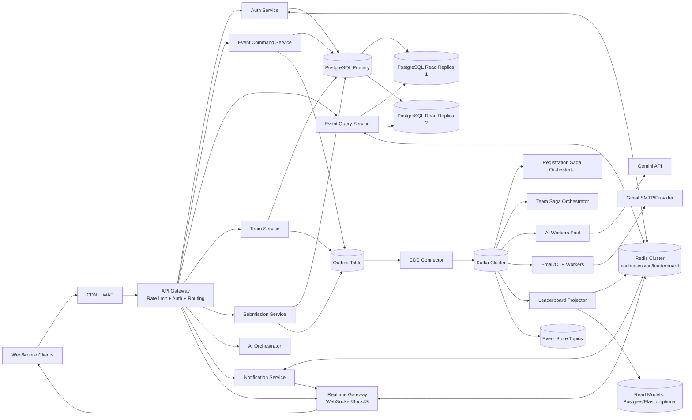
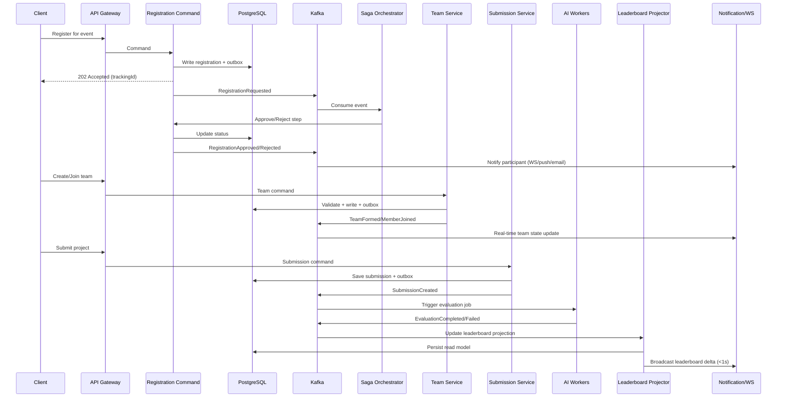
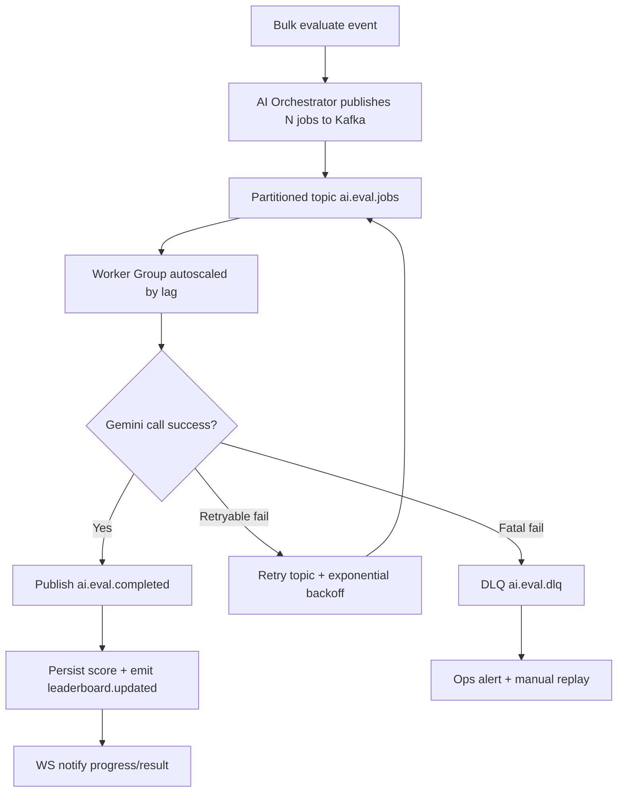

# Implementation Plan

## 1) High-Level Architecture (Mermaid)

## 2) Data Flow Diagrams

### A) Registration -> Approval -> Team -> Submission -> AI -> Leaderboard

### B) Bulk Evaluation Queue + Resilience

## 3) Technology Recommendations

### Message Broker

- Preferred: Kafka (high throughput, replay, partition scaling, event sourcing fit)
- Alternatives:
  - RabbitMQ (complex routing, lower throughput)
  - AWS SQS (managed, weaker ordering/replay)

### Cache

- Preferred: Redis Cluster (pub/sub, streams, sorted sets, sessions)
- Alternatives:
  - Memcached (cache only)
  - DynamoDB (managed KV, more complexity for pub/sub)

### Event Store

- Preferred: Kafka topics (with compaction)
- Alternative: PostgreSQL event log table

### Real-time Layer

- Preferred: Socket.io / SockJS with Redis/Kafka fanout
- Alternatives:
  - GraphQL Subscriptions
  - SSE

### Document Storage

- Primary: PostgreSQL JSONB
- Optional: MongoDB (if schema variability grows)

## 4) Scalability Metrics / SLO Targets

- Registration throughput:
  - 20,000 RPS sustained
  - 100,000 RPS burst
  - P99 latency <= 250 ms
- AI evaluation:
  - >= 2,000 teams/minute
- Real-time propagation:
  - P99 < 1 second
- Database query latency:
  - P99 < 200 ms
- Availability:
  - 99.95% (core APIs)
  - 99.9% (AI pipeline)

## 5) Migration Roadmap

### Phase 1: Kafka for notifications

- Add outbox + Kafka producer
- Keep REST fallback
- Gate: no regression, stable lag
- Rollback: feature flag to sync path

### Phase 2: Registration Saga

- Implement orchestrator + compensations
- Dual-write (legacy + events)
- Gate: shadow parity
- Rollback: revert to sync flow

### Phase 3: Realtime Layer

- Replace polling with events + WS
- Move to Redis/Kafka fanout
- Gate: <1s propagation, 70% DB load reduction
- Rollback: enable polling

### Phase 4: Async AI Evaluation

- Partitioned topics + autoscaling workers
- Retry + DLQ
- Gate: 1,000 concurrent evals
- Rollback: disable bulk endpoint

### Phase 5: DB Consolidation + Event Sourcing

- Merge services into single cluster (schema isolation)
- Enable replicas + Kafka audit
- Gate: consistency checks, failover drill
- Rollback: blue/green with CDC reverse sync

Deployment model:

- Blue-green
- Canary
- Feature flags
- Topic versioning
- Replay validation

## 6) CAP / Trade-offs

- Registration: consistency prioritized (seat allocation)
- Leaderboard: availability + eventual consistency (1-5s)
- Event updates: availability + partition tolerance (async)
- Team state: strong consistency per aggregate, eventual for projections

## 7) Key Decisions

- DB locking during AI eval:
  - Use Kafka decoupling
  - Idempotent writes, bounded workers
  - Separate connection pools
- Kafka downtime:
  - Outbox ensures durability
  - APIs remain functional (degraded async features)
- Team consistency:
  - Single-writer model
  - Optimistic locking + idempotency keys
- Notifications:
  - Fully async event-driven
  - Best-effort WS delivery
- Saga failures:
  - Compensating actions
  - Persistent saga state
  - Manual intervention queue

## 8) Risk Assessment and DR

- Kafka outage:
  - Replication factor 3, multi-AZ
  - Outbox replay
- Redis outage:
  - Sentinel/Cluster + AOF
  - Fallback to DB
- AI API outage:
  - Circuit breaker, retries, DLQ
  - Pause/resume consumers
- SMTP outage:
  - Multi-provider failover
  - Queued retries
- Observability gap:
  - Add OpenTelemetry, Prometheus, Grafana
  - Monitor:
    - API latency
    - Queue lag
    - Consumer failures
    - Saga timeouts
